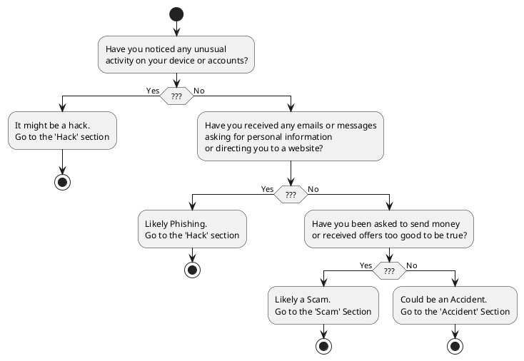
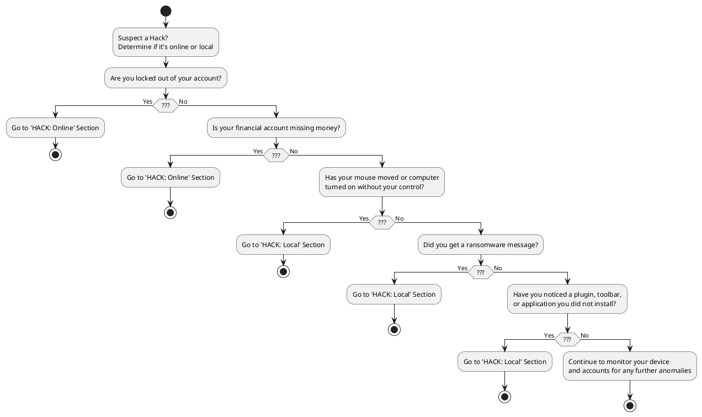

```toc
```
# Cyber Incident Guide for Personal Use
Prevention is the best option! 
The [Digital Force Protection Guide](./prevention-guide/dfp-guide) can help you prevent this from happening as well as preparing backups for recovery. 

Reacting to a potential cyber incident on personal devices, accounts, and networks 


## Step 1: Identify the incident

the first step in responding to a cyber incident is identifying what happened. The steps you take may vary depending on the nature of the incident. here are some guidelines to help you identify different types of cyber incidents:
- Monitor
- **Identify**
- Secure
- Restore
- Report
- Learn
- Monitor


--- 
## React to Hack

### HACK: Online
#### Q: Are you locked out of your account?
IF NO, conintue to the next question. 
IF YES: 
- Change the passwords and enable multi-factor authentication ([MFA guide here](./dfp-guide/mfa-guide#how-to-enable-mfa)) for these accounts:
1. Email Accounts (used to recover other accounts)
1. Finance and Banking (Big targets especially crytpo, set MFA!!)
1. Mobile Carrier (potential for changes to device and number)
1. Social Media accounts (Used for impersonating you to scam others)
#### Q: Is your financial account missing money?
IF NO, conintue to the next question. 
IF YES:
#### Q: Are there changes or activities in your accounts that you didn't make?
IF NO, conintue to the next question. 
IF YES:
- Change the password and enable multi-factor authentication ([MFA guide here](./dfp-guide/mfa-guide#how-to-enable-mfa)) for this accounts.
- If this account shared passwords with any other service, change those passwords ASAP

### HACK: Local
#### Q: Has your mouse moved or computer turned on without your control?
IF NO, conintue to the next question. 
IF YES:
- immediately secure your device by disconnecting from the internet and running a malware scan.
- [Search log files](incident-response-guide/searching-log-files.md) 
#### Q: Did you get a ransomware message? 
IF NO, conintue to the next question. 
IF YES:
- immediately secure your device by disconnecting from the internet and running a malware scan.
- [Search log files](incident-response-guide/searching-log-files.md) 
#### Q: Did you get a fake anti-virus or update message?
IF NO, conintue to the next question. 
IF YES:
- immediately secure your device by disconnecting from the internet and running a malware scan.
- [Search log files](incident-response-guide/searching-log-files.md) 
#### Q: Have you noticed a plugin, toolbar, or application installed that you did not install?
IF NO, conintue to the next question. 
IF YES:
- immediately secure your device by disconnecting from the internet and running a malware scan.
- [Search log files](incident-response-guide/searching-log-files.md) 
#### Q: Is your device running slowly or behaving abnormally?
IF NO, conintue to the next question. 
IF YES:
- immediately secure your device by disconnecting from the internet and running a malware scan.
- [Search log files](incident-response-guide/searching-log-files.md) 
#### Q: Pop-ups on the computer?
IF NO, conintue to the next question. 
IF YES:
- immediately secure your device by disconnecting from the internet and running a malware scan.
- [Search log files](incident-response-guide/searching-log-files.md) 
#### Q: Are your internet searches being redirected?
IF NO, conintue to the next question. 
IF YES:

  
### LEAK
  
#### Q: Is your private information, like photos or personal details, shared online without your permission?
IF NO, conintue to the next question. 
IF YES:
- alert family and friends to the leak and advise them to to be cautious of anyone attempting to pretend to be you.
- freeze your credit report to prevent identity theft.
#### Q: Have personal images, video, or other media been online without your permission?
IF NO, conintue to the next question. 
IF YES:
- Do not engage with the leaker or anyone else who may be attempting to contact you about the leak.
- Identify the source of the leak and lock down the source of the leak.
- Identify the content that has been leaked.
- Identify direct links to the leaked content and store them for future reference.
  
### React to a Data BREACH
  #### Q: Have you received any notifications from companies or organizations about a hack of their systems?
IF NO, conintue to the next question. 
IF YES:
- immediately secure your device by disconnecting from the internet and run a malware scan.
#### Q: Have you received any notifications from companies or organizations about a breach of their systems?
IF NO, conintue to the next question. 
IF YES:
- immediately secure your device by disconnecting from the internet and run a malware scan.
#### Q: Have you noticed any unauthorized access to your accounts?
IF NO, conintue to the next question. 
IF YES:
- immediately secure your device by disconnecting from the internet and run a malware scan.
  
### React to PHISHING
#### Q: Did you receive an email or message requesting personal or financial information?
IF NO, conintue to the next question. 
IF YES:
- mark the email as spam and delete it.
#### Q: Did you click on a suspicious link or download an attachment from an unknown source?
IF NO, conintue to the next question. 
IF YES:
- immediately secure your device by disconnecting from the internet and run a malware scan.
- Mark the email as spam and delete it.

---
### React to SCAM
#### Q: Did someone request money or your banking information from you?
IF NO, conintue to the next question. 
IF YES:
- Be cautious. Read about [common finance scams](https://www.consumerfinance.gov/ask-cfpb/what-are-some-common-types-of-scams-en-2092/)
- Scammers may pressure you with fear, desire, stress, greed, and other emotions to lower your guard.  
#### Q: Did you send money to the scammer?
IF NO, conintue to the next question. 
IF YES:
- consider the money gone, and do not pay the scammer again.
- report the incident to the local police department and [file a complaint with the ftc][1].
#### Q: Did you install anything from the scammer?
IF NO, conintue to the next question. 
IF YES:
- immediately secure your device by disconnecting from the internet and running a malware scan.
#### Q: Did you give the scammer any personal or sensitive information?
IF NO, conintue to the next question. 
IF YES:
- immediately report the incident to the local police department and [file a complaint with the ftc][1].

  
### React to ACCIDENT
#### Q: has your device been stolen?
IF NO, conintue to the next question. 
IF YES:
- immediately change all passwords for your accounts and enable two-factor authentication for all your accounts connected to the device.
- attempt to locate the device using a tracking app or service.
- factory reset the device and wipe all data from it if needed

#### Q: Did you accidentally delete important files or information?
IF NO, conintue to the next question. 
IF YES:
  
  
once you have identified the incident, it's essential to report it to the relevant authorities. depending on the nature of the incident, you may need to report it to different organizations. here are some general guidelines:
- report scam attempts to the local police department or the federal trade commission (FTC).
- if your personal or financial information has been compromised, report the incident to your bank, credit card company, and other relevant financial institutions.
- if you have suffered a data leak or breach, report it to the relevant authorities and the affected parties.

## Secure 
- Monitor
- Identify
- **Secure**
- Restore
- Report
- Learn
- Monitor

## Restore
- Monitor
- Identify
- Secure
- **Restore**
- Report
- Learn
- Monitor
## Report
- Monitor
- Identify
- Secure
- Restore
- **Report**
- Learn
- Monitor
## Learn
- Monitor
- Identify
- Secure
- Restore
- Report
- **Learn**
- Monitor
## References
- https://www.csoonline.com/article/3617849/15-signs-youve-been-hacked-and-how-to-fight-back.html?page=2

